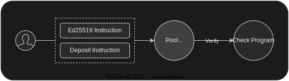

# Example: Private Pool
This example contains a simple deposit instruction that demonstrates the verification of the liquidity provider of the required credentials with Check Protocol

<div align="center">
  
</div>

## Example
Add this verification to your program:
```rust
pub fn deposit(ctx: Context<Deposit>, amount: u64) -> Result<()> {
    let attestation = &ctx.accounts.attestation;

    attestation.verify(
        instructions::load_instruction_at_checked(0, &instructions_sysvar)?,
        &user.key(),
    )?;

    // ...

    Ok(())
}
```
The deposit transaction must include two instructions, your deposit instruction and pre instruction for verification:
```typescript
const credential = Credential.fromRequestAndAttestation(request, attestation)
await program.methods
  .deposit(new BN(1000))
  .accounts({
    user: wallet.publicKey,
    attestation: attestationPublicKey,
    checkProgram: checkProgram.programId,
    instructionsSysvar: web3.SYSVAR_INSTRUCTIONS_PUBKEY,
  })
  .preInstructions([credential.request.ed25519Instruction()])
  .signers([wallet.payer])
  .rpc()
```

## Test
Run this command:
```
anchor test
```


